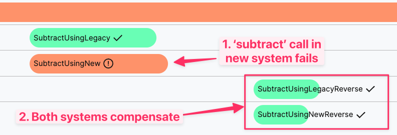
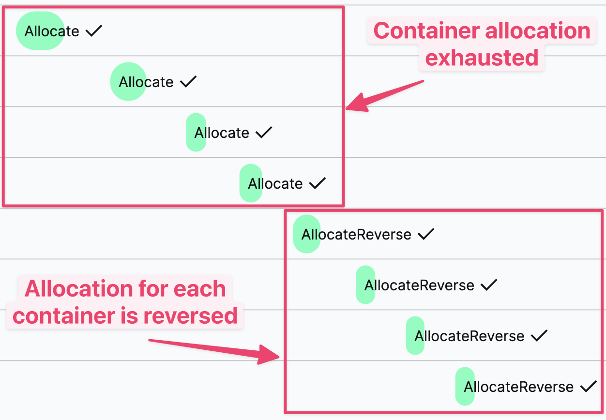

# Order Saga Sample

## Configuration

The sample is configured by default to connect to a [local Temporal Server](https://docs.temporal.io/cli#starting-the-temporal-server) running on localhost:7233.

To instead connect to Temporal Cloud, set the following environment variables, replacing them with your own Temporal Cloud credentials:

```bash
TEMPORAL_ADDRESS=testnamespace.sdvdw.tmprl.cloud:7233
TEMPORAL_NAMESPACE=testnamespace.sdvdw
TEMPORAL_CERT_PATH="/path/to/file.pem"
TEMPORAL_KEY_PATH="/path/to/file.key"
````

## Start a worker

```bash
./gradlew -q execute -PmainClass=io.temporal.samples.ordersaga.Worker
```

## Workflow Use Case 1: Split 'Subtract' Traffic with Compensations



* Splits a list of SKUs into two groups:
  * For processing by the legacy system
  * For processing by the new system
* The 'subtract' operation is run on each system (in parallel)
* If a failure in either system occurs, the workflow will run a compensation to 'reverse' the subtract operation in both systems

#### Run the workflow:
```bash
./gradlew -q execute -PmainClass=io.temporal.samples.ordersaga.splittrafficsubtract.Caller
```

#### Trigger a saga compensation:
* Uncomment either of the exceptions in SubtractActivityImpl to cause that system's subtract operation to fail
* Restart your worker, then re-run the workflow

## Workflow Use Case 2: Compensations for failures in Multi-Container Allocation



* Accepts a quantity of items to allocate across containers
* Runs `getContainerRecommendation` with hard-coded results:
  * 4 containers to allocate quantity to
  * Each container has 100 items in it
* Iterates through the list of containers (sequentially)
  * Allocates 100 items to each container until the quantity is reached and finishes the workflow

#### Run the workflow (Provide a quantity as an argument using `-Parg=<quantity>`)

Providing a quantity of 350 will succeed:
```bash
./gradlew -q execute -PmainClass=io.temporal.samples.ordersaga.containerallocation.Caller -Parg=350
```

#### Trigger a Saga allocation:
* If the quantity requested is greater than 400, the workflow will fail due to insufficient allocation
  * If an allocation fails, the workflow will run a compensation to 'reverse' the allocations in all containers

Example: Providing a quantity of 470 will fail due to insufficient containers (4 containers have 100 items each):
```bash
./gradlew -q execute -PmainClass=io.temporal.samples.ordersaga.containerallocation.Caller -Parg=350
```